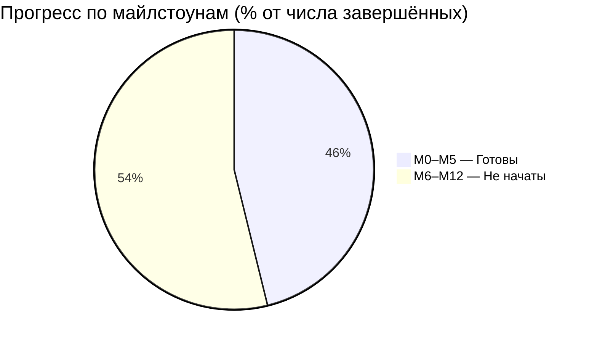

# diplomaGame — Дашборд проекта

> Центральная точка навигации хранилища. Обновляется после каждой сессии.

---

## Статус майлстоунов

| # | Майлстоун | Название | Статус | % готовности |
|---|---|---|---|---|
| M0 | Инфраструктура | Репо, LFS, CI, Project Forge, сцена-песочница | **Готов** ✅ | 100% |
| M1 | Режимы / Камеры | Cinemachine 3.1, стейт-машина, 2 Action Map | **Готов** ✅ | 100% |
| M2 | RTS-управление | Выделение, приказы, контрол-группы | **Готов** ✅ | 100% |
| M3 | TPS-герой | WASD+мышь, стрельба, способности | **Готов** ✅ | 100% |
| M4 | Бой и ИИ | HP/урон, авто-цели, FSM-поведение, SO-статы | **Готов** ✅ | 100% |
| M5 | Экономика / Постройки | Авто-добыча, очередь производства, здания | **Готов** ✅ | 100% |
| M6 | Полный UX/UI | Меню, настройки, пауза, HUD×2, тултипы, juice | Не начат | 0% |
| M7 | Аудио | Музыка/SFX/голоса, AudioMixer | Не начат | 0% |
| M8 | Визуал | Kenney/Quaternius CC0, VFX, пост-обработка | Не начат | 0% |
| M9 | Сценарий | Карта, ИИ-противник, победа/поражение | Не начат | 0% |
| M10 | Полировка | Баг-фикс, балансировка, оптимизация | Не начат | 0% |
| M11 | Сборка и релиз | GitHub Release, zip-билд | Не начат | 0% |
| M12 | Документация диплома | Пояснительная записка, презентация | Не начат | 0% |

---

## Общий прогресс

---

## Текущая сессия

| Поле | Значение |
|---|---|
| Номер сессии | Сессия 01 |
| Дата | 2026-06-10 |
| Фаза | Фаза 0 + M0–M5 (завершены) |
| Активный майлстоун | M6 — Полный UX/UI |
| Отчёт сессии | [[Reports/2026-06-10 — Сессия 01]] |

---

## Навигация по хранилищу

### Документация проекта
- [[01 - Game Design Document]] — GDD: концепция, механики, дизайн-пиллары, юниты
- [[02 - Architecture]] — Архитектура: слои, FSM, диаграммы классов
- [[03 - Roadmap]] — Роадмап с Gantt-диаграммой (M0–M12)
- [[04 - Decision Log]] — Журнал ADR (ADR-001..009)

### Ресёрч и ссылки
- [[Research/00 - Prerequisites]] — Пререквизиты: пакеты, аудио, арт, VCS

### Ассеты и лицензии
- [[Licenses & Attribution]] — Таблица CC0/CC-BY ассетов

### Статистика и отчёты
- [[Stats/Statistics]] — Метрики кодовой базы (нарастающим итогом)
- [[Reports/2026-06-10 — Сессия 01]] — Отчёт первой сессии
