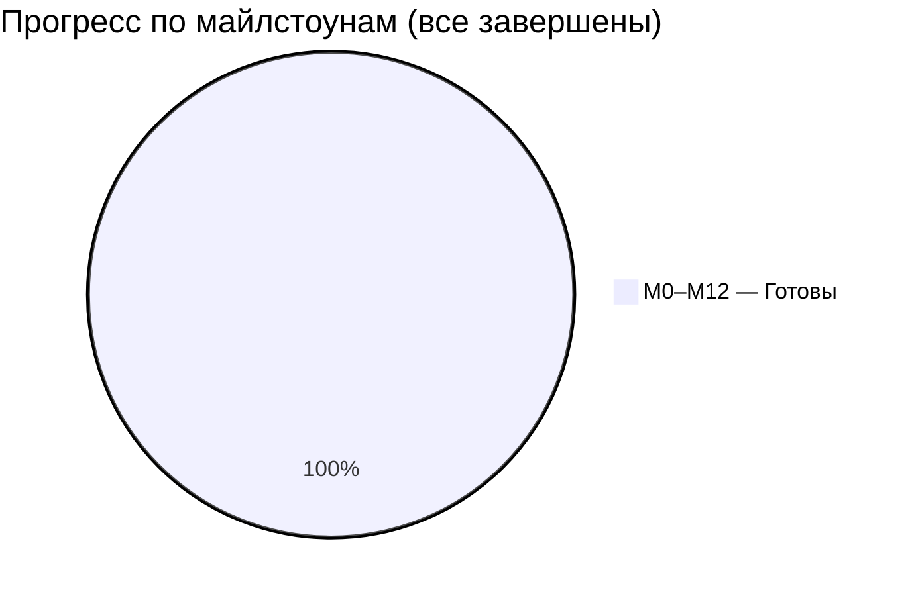

# diplomaGame — Дашборд проекта

> Центральная точка навигации хранилища. Обновляется после каждой сессии.

---

## Статус майлстоунов

| # | Майлстоун | Название | Статус | % готовности |
|---|---|---|---|---|
| M0 | Инфраструктура | Репо, LFS, CI, Project Forge, сцена-песочница | **Готов** ✅ | 100% |
| M1 | Режимы / Камеры | Cinemachine 3.1, стейт-машина, 2 Action Map | **Готов** ✅ | 100% |
| M2 | RTS-управление | Выделение, приказы, контрол-группы | **Готов** ✅ | 100% |
| M3 | TPS-герой | WASD+мышь, стрельба, способности | **Готов** ✅ | 100% |
| M4 | Бой и ИИ | HP/урон, авто-цели, FSM-поведение, SO-статы | **Готов** ✅ | 100% |
| M5 | Экономика / Постройки | Авто-добыча, очередь производства, здания | **Готов** ✅ | 100% |
| M6 | Полный UX/UI | Меню, настройки, пауза, HUD×2, тултипы, juice | **Готов** ✅ | 100% |
| M7 | Аудио | Музыка/SFX/голоса, AudioMixer | **Готов** ✅ | 100% |
| M8 | Визуал | Kenney CC0, VFX, пост-обработка | **Готов** ✅ | 100% |
| M9 | Сценарий | Карта, ИИ-противник, победа/поражение | **Готов** ✅ | 100% |
| M10 | Полировка | Баг-фикс, балансировка, оптимизация | **Готов** ✅ | 100% |
| M11 | Сборка и релиз | GitHub Release v1.0.0, ZIP-билд | **Готов** ✅ | 100% |
| M12 | Документация диплома | Architecture, GDD, Roadmap, ADR, отчёт | **Готов** ✅ | 100% |

---

## Общий прогресс

---

## Текущая фаза

| Поле | Значение |
|---|---|
| Релиз | v1.0.0 |
| Фаза | Сборка завершена → фаза улучшения (v3) |
| Следующий шаг | [[Improvements/00 - Backlog]] — backlog улучшений |
| Отчёт итоговой сессии | [[Reports/2026-06-11 — Сессия 01 (итог)]] |

---

## Навигация по хранилищу

### Документация проекта
- [[01 - Game Design Document]] — GDD: концепция, механики, дизайн-пиллары, баланс, раздел «Сниженный APM»
- [[02 - Architecture]] — Архитектура: слои, FSM, диаграммы классов, событийная шина, тестируемость
- [[03 - Roadmap]] — Роадмап с Gantt-диаграммой (M0–M12, фактические даты)
- [[04 - Decision Log]] — Журнал ADR (ADR-001..012)

### Ресёрч и ссылки
- [[Research/00 - Prerequisites]] — Пререквизиты: пакеты, аудио, арт, VCS

### Ассеты и лицензии
- [[Licenses & Attribution]] — Таблица CC0/CC-BY ассетов

### Статистика и отчёты
- [[Stats/Statistics]] — Метрики кодовой базы (нарастающим итогом)
- [[Reports/2026-06-10 — Сессия 01]] — Хронология всех майлстоунов и пойманных багов
- [[Reports/2026-06-11 — Сессия 01 (итог)]] — Итоговое резюме всей сессии

### Улучшения (v3)
- [[Improvements/00 - Backlog]] — Backlog идей и улучшений для будущих версий
