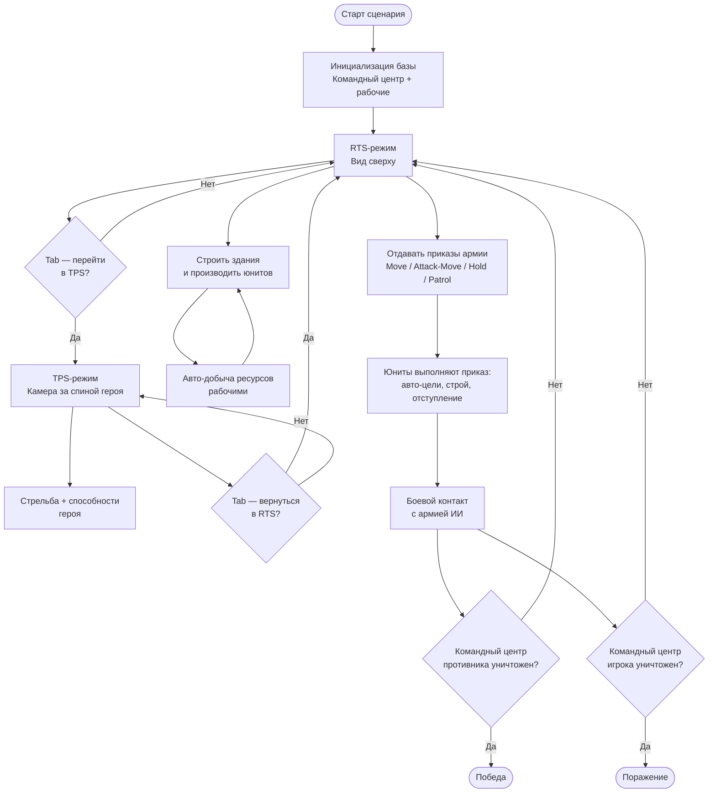

# 01 — Game Design Document

> Версия 0.1 (Фаза 0, 2026-06-10). Уточняется по мере реализации майлстоунов.

---

## 1. Концепция

**diplomaGame** — 3D-игра в жанре гибрид RTS + TPS. Игрок одновременно командует армией с видом сверху (RTS-режим) и лично управляет героем от третьего лица (TPS-режим). Переключение мгновенное, по Tab. Герой — полноценный юнит армии и в RTS-режиме.

**Вдохновение:** StarCraft II — тактическая глубина, ощущение от управления армией.

**Контент MVP:** одна карта-сценарий. База игрока + база ИИ-противника + ресурсные зоны. Победа — уничтожение главного здания противника.

---

## 2. Дизайн-пиллары

| # | Пиллар | Суть |
|---|---|---|
| 1 | **Сниженный порог входа** | Умный ИИ юнитов и авто-экономика убирают рутинный микроменеджмент, сохраняя тактические решения |
| 2 | **Двойная перспектива** | Tab переключает режимы без разрыва потока; каждый режим усиливает другой |
| 3 | **Герой как ось геймплея** | TPS-герой — самый мощный юнит и инструмент тактических прорывов; его потеря критична |
| 4 | **Тактическая глубина без APM** | Победа достигается правильными приказами и позиционированием, а не скоростью кликов |

---

## 3. Целевая аудитория

- Игроки, которым интересна стратегия, но которых отпугивает высокий APM классических RTS.
- Фанаты TPS, которым интересен командный масштаб.
- Академическая аудитория: демонстрация снижения порога входа как исследовательской гипотезы.

---

## 4. Игровые режимы

### 4.1 RTS-режим

**Камера:** изометрическая, вид сверху. Движение краем экрана и WASD, зум колёсиком мыши.

**Управление юнитами:**
- Выделение кликом — один юнит.
- Выделение рамкой (drag) — все юниты в прямоугольнике.
- Ctrl+клик — добавить/убрать из выделения.
- Цифровые клавиши 1–9 — контрол-группы (назначить Ctrl+N, вызвать N).

**Приказы (правая кнопка мыши или кнопки HUD):**
- **Move** — переместиться в точку.
- **Attack-Move** — двигаться, атакуя врагов по пути.
- **Hold** — стоять на месте, атаковать в радиусе.
- **Patrol** — курсировать между двумя точками, реагируя на врагов.
- **Stop** — сброс текущего приказа.

**Строительство:** выбрать строителя → кнопка здания в HUD → клик по карте → здание строится автоматически.

**Производство:** клик по зданию → очередь юнитов в HUD → юниты появляются у точки сбора.

**Экономика:** авто-добыча ресурсов (рабочие юниты сами идут к ближайшей ресурсной зоне и добывают). Ресурсы 2 типа: Металл (добывается) и Энергия (генераторы строятся). Оба тратятся на постройки и производство.

### 4.2 TPS-режим

**Камера:** за спиной героя (Cinemachine 3.1 `CinemachineCamera` + `ThirdPersonFollow`). Прицеливание правой кнопкой мыши (ADS) опционально в M3.

**Управление:**
- WASD — движение.
- Мышь — обзор (поворот камеры и разворот героя).
- ЛКМ — стрельба (основное оружие).
- ПКМ — прицел / ADS (при наличии).
- Пробел — уклонение / рывок.
- Q, E, R, F — 4 способности героя (кулдаун, мана или заряды — TBD-баланс).

**Герой в TPS** виден тем же юнитом, что и в RTS. Гибель героя = потеря юнита. Производство нового героя возможно, если есть соответствующее здание.

### 4.3 Переключение режимов

- **Tab** — мгновенное переключение.
- При переходе в TPS камера прыгает к герою.
- При переходе в RTS камера возвращается на позицию, сохранённую перед уходом в TPS.
- Оба режима работают в реальном времени: армия действует по последним приказам, пока игрок в TPS.
- HUD меняется соответственно режиму. Миникарта присутствует в обоих режимах.

---

## 5. Ключевая механика переключения

Игровой цикл строится на постоянном маятнике: выдать приказы армии в RTS → перейти в TPS и лично провести атаку / защитить героя → вернуться в RTS и скорректировать тактику. Каждый переход имеет тактический смысл: в TPS герой в несколько раз эффективнее как один юнит, в RTS игрок видит картину целиком.

---

## 6. Таблица юнитов и зданий (черновик, TBD-баланс)

### Юниты

| Тип | Роль | HP | Урон | Поведение ИИ |
|---|---|---|---|---|
| Пехотинец | Базовая пехота | TBD | TBD | Держит строй, автоцель по ближайшему врагу, отступает при HP < 20% |
| Танк | Тяжёлый, бронированный | TBD | TBD (AoE) | Удерживает позицию, приоритет по зданиям и тяжёлым юнитам |
| Рабочий | Добыча / строительство | TBD | TBD (мал.) | Авто-добыча ресурсов, уходит от боя при атаке |
| Герой | Элитный юнит (TPS) | TBD | TBD (4 способности) | В RTS — как пехотинец, но мощнее; в TPS — под управлением игрока |

### Здания

| Тип | Роль | HP | Стоимость |
|---|---|---|---|
| Командный центр | Победное условие, производство рабочих | TBD | — (стартовое) |
| Казарма | Производство пехотинцев и героя | TBD | TBD |
| Завод | Производство танков | TBD | TBD |

> Все числа помечены TBD-баланс. Значения уточнятся в M4 (бой и ИИ) через балансировочные итерации.

---

## 7. Сниженный микроменеджмент — ядро диплома

Академическая новизна работы: системное снижение требуемого APM (Actions Per Minute) без потери тактической глубины. Каждое проектное решение обосновано:

| Решение | Как снижает микроменеджмент | Сохраняет глубину |
|---|---|---|
| **Авто-добыча ресурсов** | Рабочие сами идут к ресурсу и возвращаются; не нужно вручную назначать каждый сбор | Игрок всё равно решает, сколько рабочих строить и когда расширять базу |
| **Умный ИИ юнитов (FSM)** | Юниты сами выбирают цели в радиусе, держат строй при движении, отступают при критическом HP | Тактические решения (куда послать, каким приказом) остаются за игроком |
| **Групповые приказы** | Один приказ применяется ко всей группе; контрол-группы позволяют управлять несколькими армиями одним нажатием | Формирование групп и расстановка приоритетов — тактическое мышление |
| **Упрощённая экономика (2 ресурса)** | Минимум ресурсных цепочек; нет сложной технологического дерева из 10+ зданий | Решения о расширении / военном производстве — стратегический выбор |
| **TPS-герой снижает APM** | В TPS игрок вручную управляет одним, но очень эффективным юнитом вместо одновременного управления 20+ | Позиционирование героя, выбор способностей, выбор момента переключения — высокий скилл |

---

## 8. Игровой цикл (flowchart)

