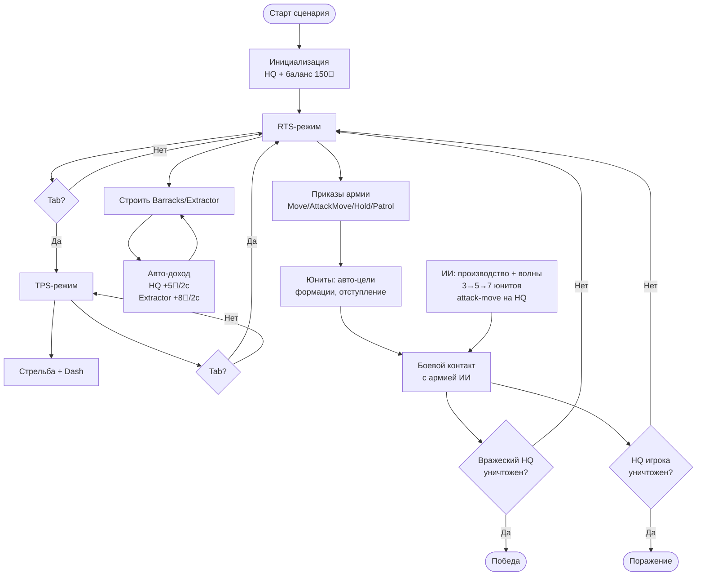

# 01 — Game Design Document

> Версия 1.0 (финал M12, 2026-06-11). Всё ядро реализовано и задокументировано. Релиз v1.0.0.

---

## 1. Концепция

**diplomaGame** — 3D-игра в жанре гибрид RTS + TPS. Игрок одновременно командует армией с видом сверху (RTS-режим) и лично управляет героем от третьего лица (TPS-режим). Переключение мгновенное, по Tab. Герой — полноценный юнит армии и в RTS-режиме.

**Вдохновение:** StarCraft II — тактическая глубина, ощущение от управления армией.

**Контент MVP:** одна карта-сценарий. База игрока + база ИИ-противника + ресурсные зоны. Победа — уничтожение главного здания (HQ) противника.

**Статус:** реализован в полном объёме (M0–M11). Релиз v1.0.0 опубликован на GitHub.

---

## 2. Дизайн-пиллары

| # | Пиллар | Суть | Статус |
|---|---|---|---|
| 1 | **Сниженный порог входа** | Умный ИИ юнитов и авто-экономика убирают рутинный микроменеджмент, сохраняя тактические решения | Реализован — см. раздел 7 |
| 2 | **Двойная перспектива** | Tab переключает режимы без разрыва потока; каждый режим усиливает другой | Реализован — M1, M3 |
| 3 | **Герой как ось геймплея** | TPS-герой — самый мощный юнит и инструмент тактических прорывов; его потеря не критична (респаун 8с) | Реализован — M3, M9 |
| 4 | **Тактическая глубина без APM** | Победа достигается правильными приказами и позиционированием, а не скоростью кликов | Реализован — вся система приказов и боевого ИИ |

---

## 3. Целевая аудитория

- Игроки, которым интересна стратегия, но которых отпугивает высокий APM классических RTS.
- Фанаты TPS, которым интересен командный масштаб.
- Академическая аудитория: демонстрация снижения порога входа как исследовательской гипотезы.

---

## 4. Игровые режимы

### 4.1 RTS-режим

**Камера:** изометрическая, вид сверху. Движение WASD, зум колёсиком мыши.

**Управление юнитами:**
- Выделение кликом — один юнит или здание.
- Выделение рамкой (drag) — все юниты в прямоугольнике.
- Shift+клик — добавить/убрать из выделения.
- Цифровые клавиши 1–5 — контрол-группы (назначить Ctrl+N, вызвать N).

**Приказы (правая кнопка мыши или клавиши HUD):**
- **Move (RMB)** — переместиться в точку, игнорируя врагов.
- **Attack-Move (A+RMB)** — двигаться, атакуя врагов по пути (расширенный сканируемый aggro-радиус × 3).
- **Hold (H)** — стоять на месте, атаковать в aggro-радиусе, не преследовать.
- **Patrol (P+RMB)** — курсировать между стартовой точкой и целевой, реагируя на врагов.
- **Stop** — сброс NavMeshAgent.

**Строительство:** B — Barracks, E — Extractor → призрак со статусом (зелёный/красный) → LMB — постройка; ESC — отмена. Стоимость списывается сразу.

**Производство:** клик по зданию → T — добавить в очередь (до 5 позиций) → юниты появляются у rally-point. RMB по зданию — установить rally-point.

**Экономика:** один ресурс — Кристаллы (💎). Авто-добыча без рабочих: HQ пассивно приносит доход, Extractor добывает с ближайшего ResourceNode (запас исчерпаем). Оба здания начисляют ресурс раз в IncomeTickInterval секунд.

### 4.2 TPS-режим

**Камера:** за спиной героя (Cinemachine 3.1 `CinemachineCamera` + `ThirdPersonFollow`). Кроссфейд при переключении ~2с.

**Управление:**
- WASD — движение относительно yaw героя.
- Мышь — поворот камеры и разворот героя.
- ЛКМ — стрельба (raycast из центра экрана, урон через `IDamageable`).
- Q — Dash (рывок вперёд, кулдаун из `AbilityData`).
- E, R, F — слоты 2–4 (заглушки в текущей версии, архитектура готова).

**Герой в TPS** — тот же объект, что и в RTS: `Unit` + `UnitCombat` + `Health` + `HeroController` + `HeroShooter` + `AbilitySystem`. Гибель героя — не поражение: корутина 8с → телепорт к PlayerBaseSpawn + полное HP.

### 4.3 Переключение режимов

- **Tab** — мгновенный вызов `GameModeController.SwitchMode()`.
- Оба режима работают в реальном времени: армия действует по последним приказам, пока игрок в TPS.
- HUD меняется по событию `ModeChanged`. Миникарта — только в RTS HUD.

---

## 5. Ключевая механика переключения

Игровой цикл строится на постоянном маятнике: выдать приказы армии в RTS → перейти в TPS и лично провести атаку / использовать Dash для прорыва → вернуться в RTS и скорректировать тактику. Каждый переход имеет тактический смысл: в TPS герой наносит значительно больше DPS как единица управления, в RTS игрок видит картину целиком и координирует несколько групп.

---

## 6. Таблица юнитов и зданий (финальный баланс)

### Юниты

| Тип | Роль | HP | Урон | Кулдаун атаки | Aggro | Скорость | Отступление |
|---|---|---|---|---|---|---|---|
| **Marine** (игрок) | Базовая пехота | 100 | 10 | 1.0 с | 12 м | 5 м/с | < 25% HP |
| **EnemyGrunt** (ИИ) | Пехота противника | 80 | 8 | 1.0 с | 12 м | 5 м/с | < 25% HP |
| **Герой** (игрок) | Элитный юнит (TPS) | 150 | 10 (raycast) | 0.15 с | — | 5 м/с | нет (управляется вручную) |

> Статы хранятся в SO-ассетах: `Assets/_Project/Data/Units/Marine.asset`, `EnemyGrunt.asset`. Герой получает `Health.Init(150)` от `UnitCombat` при старте.

### Здания

| Тип | Роль | HP | Стоимость | Доход |
|---|---|---|---|---|
| **HQ** (Headquarters) | Победное условие обеих сторон | 1000 | — (стартовое) | +5 💎 каждые 2 с |
| **Barracks** | Производство Marine | 300 | 100 💎 | — |
| **Extractor** | Добыча с ResourceNode | 200 | 75 💎 | +8 💎 каждые 2 с (из ноды) |

> Производство Marine: стоимость 50 💎, время 5 с. Максимальная очередь — 5. Стартовый баланс обеих сторон — 150 💎.

### ИИ-противник

| Параметр | Значение |
|---|---|
| Лимит юнитов | 12 |
| Интервал решений | 2 с |
| Размер волны (0–60 с матча) | 3 юнита |
| Размер волны (60–120 с) | 5 юнитов |
| Размер волны (> 120 с) | 7 юнитов |
| Принудительный запуск волны | 30 с без атаки |

---

## 7. Сниженный микроменеджмент — реализация и выводы

Академическая новизна работы: системное снижение требуемого APM (Actions Per Minute) без потери тактической глубины. Ниже — реализованные механики с описанием фактического поведения.

### 7.1 Реализованные механизмы снижения APM

| Механика | Реализация | Как снижает APM | Сохраняет глубину |
|---|---|---|---|
| **Авто-добыча без рабочих** | `Building.Update` + `EconomyLogic.CalculateIncomeTicks` — пассивный доход от HQ и Extractor, без рабочих | Нет задачи «вручную назначать каждый цикл сбора» | Игрок решает, когда строить Extractor, сколько их нужно, у каких нод размещать |
| **Авто-цели** | `UnitCombat.ScanForTarget()` каждые 0.25 с — ближайший враг (юнит или здание вражеской фракции) без аллокаций | Игрок не таргетирует каждую атаку вручную | Тип приказа (Move/Hold/AttackMove) влияет на aggro-логику — тактический выбор остаётся |
| **Авто-отступление с отменой приказом** | `CombatState.Retreating` при HP < 25%; `Unit.CommandIssued` → `_retreatTriggered = false` | Раненые юниты сами уходят из-под огня — не нужно следить за каждым HP-баром | Прямой приказ игрока мгновенно отменяет отступление: можно приказать юниту держаться |
| **Формационные смещения** | `UnitCommandLogic.GetFormationOffset(index, count)` — юниты занимают позиции вокруг цели | Не нужно вручную разводить юнитов по точкам, чтобы не стоять в одном месте | Формация выстраивается автоматически; Rally-point определяет место сбора |
| **Анти-застревание** | `Unit.Update`: если `velocity.sqrMagnitude < 0.01` более 1.5 с при `Moving` → считается прибывшим | Юниты, плотно сгрудившиеся у rally-point или здания, не блокируют волны ИИ и не требуют ручного «разлепливания» | Прозрачно для игрока, работает автоматически |
| **Авто-rally у производства** | `ProductionBuilding` при создании юнита выдаёт ему приказ `Move(rallyPoint)` — не нужно вручную отправлять каждого | Все произведённые юниты сами двигаются к назначенной точке сбора | RMB по зданию меняет rally-point — одно действие меняет поведение всего производства |
| **Групповые приказы** | `CommandInput.RMB` → `foreach selected unit: IssueCommand(cmd)` с FormationOffset | Один приказ управляет всей выделенной группой | Контрол-группы 1–5 позволяют держать несколько армий под разными клавишами |
| **Один ресурс вместо двух** | `ResourceBank` хранит один баланс «Кристаллы» на фракцию | Нет разделения «копить металл отдельно от энергии» | Решения о расширении базы vs. наращивании армии — стратегический выбор с одним ресурсом |

### 7.2 Вывод для диплома

Реализованный набор механик демонстрирует, что снижение APM достигается не упрощением правил, а переносом рутинных операций на автоматику. Игрок принимает стратегические решения (куда отправить армию, что построить, когда переключиться в TPS), но не выполняет механические повторяющиеся действия (таргетирование, назначение рабочих, микроуправление HP каждого юнита). Боевые тесты (PlayMode: `MatchSimulationTests`, timeScale×10) подтвердили, что сценарий завершается как победой, так и поражением — баланс играбелен.

---

## 8. Игровой цикл (flowchart)

