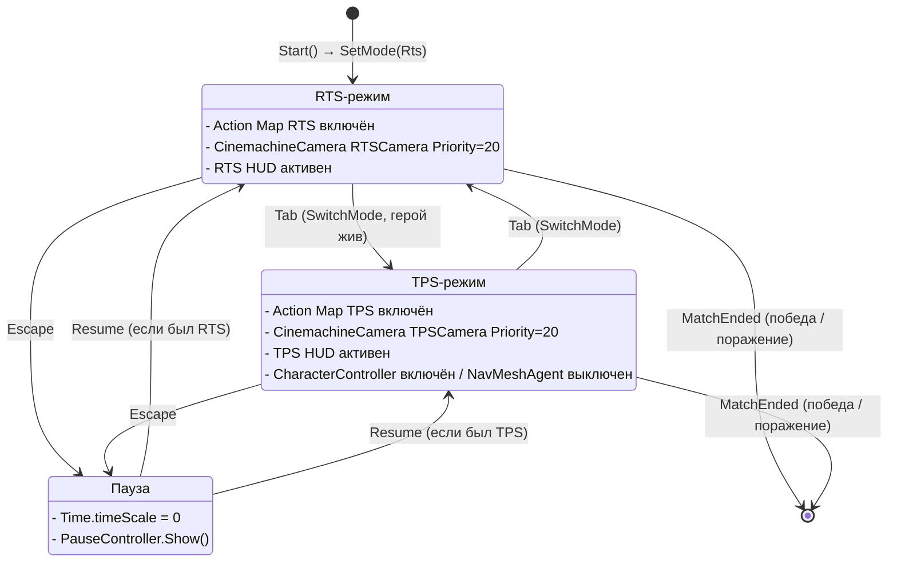
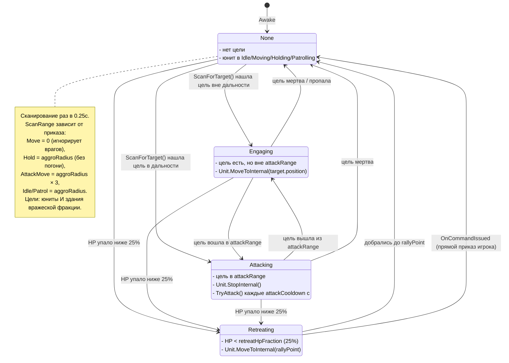
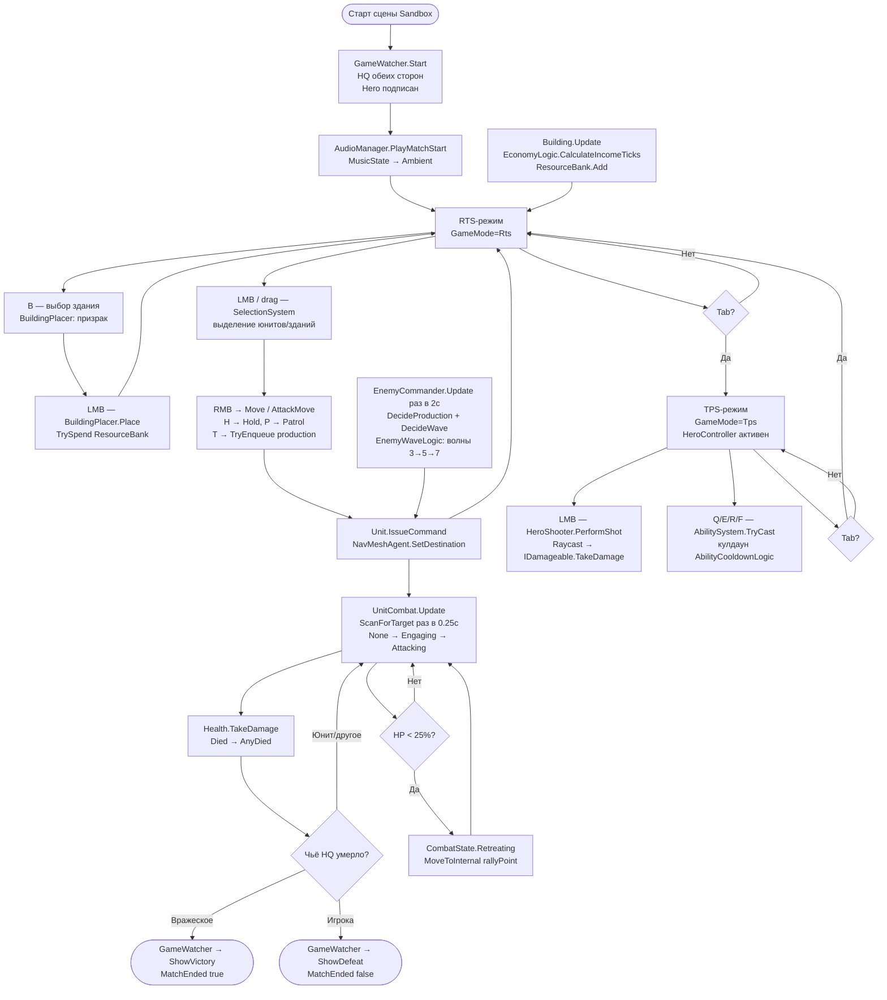

# 02 — Architecture

> Версия 1.0 (финал M12, 2026-06-11). Диаграммы соответствуют фактическому коду релиза v1.0.0.

---

## 1. Принципы

- **ScriptableObject-данные** — все статы юнитов (`UnitData`), зданий (`BuildingData`), способностей (`AbilityData`) — в SO-ассетах. Изменение баланса — без перекомпиляции.
- **События вместо жёсткой связности** — системы общаются через C# events. Статические события (`Health.AnyDied`, `UnitCombat.AnyAttacked`, `BuildingRegistry.BuildingRegistered`, `GameWatcher.MatchEnded`) образуют широковещательную шину для Audio и VFX без прямых ссылок. Инстанс-события (`ModeChanged`, `BalanceChanged`, `ShotFired`, `SelectionChanged`, `OrderIssued`, `CommandIssued`, `UnitProduced`, `BuildingPlaced`, `PlacementFailed`) связывают конкретные пары компонентов.
- **Без god-объектов** — нет монолитного `GameManager`. Ответственность разбита: `GameModeController` (режимы), `GameWatcher` (арбитр матча), `ResourceBank` (экономика), `SelectionSystem` (выделение), `EnemyCommander` (ИИ).
- **Логика отдельно от MonoBehaviour** — чистые C#-классы (`CombatLogic`, `UnitCommandLogic`, `EconomyLogic`, `ProductionQueueLogic`, `PlacementLogic`, `ModeSwitchLogic`, `HeroMovementLogic`, `FireRateLogic`, `AbilityCooldownLogic`, `SelectionLogic`, `HudLogic`, `AudioLogic`, `VfxLogic`, `EnemyWaveLogic`, `SettingsLogic`) содержат всю вычислимую логику и тестируются в EditMode без запуска сцены.
- **Паттерн `InitForTest`** — каждый MonoBehaviour с внешними зависимостями имеет `internal` метод `InitForTest(...)`, который подставляет тестовые данные без `SerializedObject`. Это позволяет строить PlayMode-тесты без Forge-сетапа.

---

## 2. Слои архитектуры

```
┌──────────────────────────────────────────────────────────────────┐
│                        Input Layer                               │
│  Input System 1.19 · Action Maps: RTS / TPS · кросс-режимный    │
│  SwitchMode (Tab) · Escape — CommandInput, SelectionSystem       │
├──────────────────────────────────────────────────────────────────┤
│                     GameMode FSM Layer                           │
│  GameModeController (ModeSwitchLogic) · ModeChanged event        │
│  Cinemachine 3.1 приоритеты RTS=20/TPS=10 · Action Map on/off   │
├──────────────────────────────────────────────────────────────────┤
│           Selection / Commands          │       Hero             │
│  SelectionSystem (SelectionLogic)       │  HeroController        │
│  CommandInput → Unit.IssueCommand       │  HeroShooter           │
│  UnitRegistry (статика, без аллокаций)  │  AbilitySystem         │
├──────────────────────────────────────────────────────────────────┤
│              Units / Combat / Economy / Buildings                 │
│  Unit · UnitCombat (FSM: None/Engaging/Attacking/Retreating)     │
│  Health (IDamageable) · CombatLogic                              │
│  ResourceBank · EconomyLogic · ResourceNode                      │
│  Building · ProductionBuilding · BuildingPlacer · BuildingRegistry│
├──────────────────────────────────────────────────────────────────┤
│                AI / Scenario                                     │
│  EnemyCommander · EnemyWaveLogic · GameWatcher                   │
├──────────────────────────────────────────────────────────────────┤
│              Presentation (подписывается, не управляет)          │
│  HudController · AudioManager · VfxManager                       │
│  UI: ResourceDisplay, SelectionPanel, AbilitySlotUI, HealthBar   │
│  Audio: MusicState FSM (Menu/Ambient/Combat), кроссфейд 1.5с     │
│  VFX: пулы частиц × 4 типа                                       │
└──────────────────────────────────────────────────────────────────┘
```

Зависимость строго сверху вниз. Presentation слой только подписывается на события нижних слоёв — никогда не управляет ими напрямую.

---

## 3. Стейт-машина режимов (stateDiagram-v2)



**Детали переключения:** `GameModeController.SetMode()` — идемпотентная операция. Повторный вызов с тем же режимом не вызывает события и не трогает камеры. При переходе в TPS `HeroController` получает `ModeChanged` → `agent.enabled=false`, `CharacterController.enabled=true`; при возврате в RTS — обратно. Подписка — в `Awake/OnDestroy`, а не `OnEnable/OnDisable` (самоотключение разорвало бы подписку).

---

## 4. Боевой FSM юнита (stateDiagram-v2)



---

## 5. Диаграмма ключевых классов (classDiagram)

```mermaid
classDiagram
    %% ── Core ──────────────────────────────────────────────────────
    class GameModeController {
        +GameMode CurrentMode
        +event ModeChanged : Action~GameMode~
        +SwitchMode()
        +SetMode(GameMode)
        -InitForTest(rts, tps)
    }

    class GameWatcher {
        +static event MatchEnded : Action~bool~
        -WatchHQs(playerHQ, enemyHQ)
        -InitForTest(gameOver)
        -RespawnHeroCoroutine() IEnumerator
    }

    class ModeSwitchLogic {
        <<static>>
        +Toggle(GameMode) GameMode
        +GetPriorities(GameMode) tuple
    }

    %% ── Combat ────────────────────────────────────────────────────
    class Health {
        +float CurrentHp
        +float MaxHp
        +float Fraction
        +bool IsDead
        +event Damaged : Action~float,float~
        +event Died : Action
        +static event AnyDied : Action~Health~
        +TakeDamage(float)
        +Init(float)
    }

    class IDamageable {
        <<interface>>
        +TakeDamage(float)
    }

    class CombatLogic {
        <<static>>
        +FindNearestTargetIndex(from, candidates, range) int
        +ShouldRetreat(hpFraction, retreatFraction, disabled) bool
        +IsInRange(a, b, range) bool
        +GetRetreatPoint(unitPos, threatPos, rallyPoint) Vector3
    }

    %% ── Units ─────────────────────────────────────────────────────
    class Unit {
        +Faction Faction
        +UnitState CurrentState
        +UnitCommandType? CurrentCommandType
        +Health CachedHealth
        +event CommandIssued : Action~UnitCommand~
        +IssueCommand(UnitCommand)
        +SetSelected(bool)
        -MoveToInternal(Vector3)
        -StopInternal()
    }

    class UnitCombat {
        +CombatState CurrentCombatState
        +static event AnyAttacked : Action~Vector3~
        -UnitData _data
        -Health _currentTargetHealth
        +InitForTest(UnitData)
    }

    class UnitRegistry {
        <<static>>
        +List~Unit~ AllUnits
        +Register(Unit)
        +Unregister(Unit)
        +GetUnits(Faction, buffer)
    }

    class UnitCommandLogic {
        <<static>>
        +HasArrived(remaining, stopping, pending) bool
        +GetNextPatrolPoint(pos, a, b) Vector3
        +GetFormationOffset(index, count) Vector3
    }

    %% ── Data ──────────────────────────────────────────────────────
    class UnitData {
        <<ScriptableObject>>
        +float MaxHp
        +float Damage
        +float AttackRange
        +float AttackCooldown
        +float AggroRadius
        +float MoveSpeed
        +float RetreatHpFraction
        +bool RetreatDisabled
        +CreateForTest(...) UnitData$
    }

    class BuildingData {
        <<ScriptableObject>>
        +BuildingType BuildingType
        +float MaxHp
        +int Cost
        +int ProductionCost
        +int IncomePerTick
        +float IncomeTickInterval
    }

    class AbilityData {
        <<ScriptableObject>>
        +AbilityType AbilityType
        +float Cooldown
        +float DashDistance
        +string DisplayName
    }

    %% ── Buildings ─────────────────────────────────────────────────
    class Building {
        +BuildingData Data
        +Faction Faction
        +Health CachedHealth
        +InitForTest(data, faction, bank)
    }

    class ProductionBuilding {
        +event UnitProduced : Action~Unit~
        +TryEnqueue() bool
        +InitForTest(data, faction, bank, prefab, spawn)
    }

    class BuildingRegistry {
        <<static>>
        +static event BuildingRegistered : Action~Building~
        +Register(Building)
        +Unregister(Building)
        +GetBuildings(Faction, buffer)
    }

    class BuildingPlacer {
        +event BuildingPlaced : Action~Vector3~
        +event PlacementFailed : Action
    }

    %% ── Economy ───────────────────────────────────────────────────
    class ResourceBank {
        +event BalanceChanged : Action~Faction,int~
        +GetBalance(Faction) int
        +TrySpend(Faction, int) bool
        +Add(Faction, int)
        +InitForTest(playerBal, enemyBal)
    }

    class EconomyLogic {
        <<static>>
        +CanAfford(balance, cost) bool
        +Spend(balance, cost) int
        +CalculateIncomeTicks(acc, interval, remainder) int
    }

    %% ── Hero ──────────────────────────────────────────────────────
    class HeroController {
        +Dash(float)
        +InitForTest(controller)
    }

    class HeroShooter {
        +event ShotFired : Action~Vector3,Vector3,bool~
        +InitForTest(controller, cam)
        -TryFire()
    }

    class AbilitySystem {
        +event AbilityCast : Action~int,AbilityData~
        +GetRemainingCooldown(int) float
        +GetAbility(int) AbilityData
        +InitForTest(controller, hero, abilities)
    }

    class FireRateLogic {
        <<static>>
        +CanFire(lastTime, cooldown, now) bool
    }

    class AbilityCooldownLogic {
        <<static>>
        +Tick(remaining, dt) float
        +IsReady(remaining) bool
        +StartCooldown(duration) float
    }

    %% ── Selection / Commands ──────────────────────────────────────
    class SelectionSystem {
        +List~object~ Selected
        +event SelectionChanged : Action
        +SelectionLogic _logic
    }

    class CommandInput {
        +event OrderIssued : Action~Vector3,UnitCommandType~
    }

    %% ── AI ────────────────────────────────────────────────────────
    class EnemyCommander {
        +int UnitsAlive
        +float TimeSinceLastWave
        +InitForTest(bank, barracks, interval)
    }

    class EnemyWaveLogic {
        <<static>>
        +GetWaveSizeForTime(matchTime) int
        +ShouldLaunchWave(idleCount, waveSize, timeSince, maxWait) bool
        +ShouldProduce(balance, cost, current, max) bool
    }

    %% ── Audio / VFX ───────────────────────────────────────────────
    class AudioManager {
        +static Instance : AudioManager
        +MusicState CurrentMusicState
        +SetMusicState(MusicState)
        +PlaySfx(clips, pos, vol)
        +SetCategoryVolume(cat, val)
        +InitForTest(menu, ambient, combat, acks)
    }

    class VfxManager {
        +InitForTest(prefabs)
    }

    %% ── Relationships ─────────────────────────────────────────────
    Health ..|> IDamageable
    Unit --> Health : CachedHealth (lazy)
    Unit --> UnitCommandLogic : uses
    Unit --> UnitRegistry : Register/Unregister
    UnitCombat --> Unit : RequireComponent
    UnitCombat --> Health : RequireComponent
    UnitCombat --> CombatLogic : uses
    UnitCombat --> UnitRegistry : GetUnits()
    UnitCombat --> BuildingRegistry : GetBuildings()
    UnitCombat --> UnitData : _data SO
    Building --> Health : RequireComponent
    Building --> BuildingData : _data SO
    Building --> BuildingRegistry : Register/Unregister
    Building --> EconomyLogic : CalculateIncomeTicks
    Building --> ResourceBank : Add()
    ProductionBuilding --> Building : sibling component
    GameModeController --> ModeSwitchLogic : uses
    GameWatcher --> BuildingRegistry : GetBuildings()
    GameWatcher --> Health : подписка Died
    HeroShooter --> FireRateLogic : CanFire()
    HeroShooter --> GameModeController : ModeChanged
    AbilitySystem --> AbilityCooldownLogic : Tick/IsReady
    AbilitySystem --> GameModeController : CurrentMode
    SelectionSystem --> Unit : tracks
    CommandInput --> Unit : IssueCommand
    EnemyCommander --> EnemyWaveLogic : uses
    EnemyCommander --> ResourceBank : GetBalance()
    EnemyCommander --> UnitRegistry : GetUnits()
    EnemyCommander --> BuildingRegistry : GetBuildings()
    AudioManager --> Health : AnyDied (статика)
    AudioManager --> UnitCombat : AnyAttacked (статика)
    AudioManager --> HeroShooter : ShotFired
    AudioManager --> SelectionSystem : SelectionChanged
    AudioManager --> CommandInput : OrderIssued
    AudioManager --> BuildingPlacer : BuildingPlaced / PlacementFailed
    AudioManager --> BuildingRegistry : BuildingRegistered (статика)
    AudioManager --> GameWatcher : MatchEnded (статика)
    VfxManager --> Health : AnyDied (статика)
    VfxManager --> HeroShooter : ShotFired
    VfxManager --> BuildingPlacer : BuildingPlaced
```



---

## 6. Событийная шина (сводная таблица)

| Событие | Тип | Источник | Подписчики |
|---|---|---|---|
| `Health.AnyDied` | статик `Action<Health>` | `Health.TakeDamage` | `AudioManager`, `VfxManager` |
| `UnitCombat.AnyAttacked` | статик `Action<Vector3>` | `UnitCombat.TryAttack` | `AudioManager` |
| `BuildingRegistry.BuildingRegistered` | статик `Action<Building>` | `Building.OnEnable` | `AudioManager` |
| `GameWatcher.MatchEnded` | статик `Action<bool>` | `GameWatcher` | `AudioManager` |
| `GameModeController.ModeChanged` | инстанс `Action<GameMode>` | `GameModeController.SetMode` | `HeroController`, `HeroShooter`, `HudController` |
| `ResourceBank.BalanceChanged` | инстанс `Action<Faction,int>` | `ResourceBank.TrySpend/Add` | `ResourceDisplay`, `UiPulse` |
| `HeroShooter.ShotFired` | инстанс `Action<Vector3,Vector3,bool>` | `HeroShooter.PerformShot` | `AudioManager`, `VfxManager` |
| `SelectionSystem.SelectionChanged` | инстанс `Action` | `SelectionSystem` | `AudioManager`, `SelectionPanel` |
| `CommandInput.OrderIssued` | инстанс `Action<Vector3,UnitCommandType>` | `CommandInput` | `AudioManager`, `OrderMarkerFeedback` |
| `Unit.CommandIssued` | инстанс `Action<UnitCommand>` | `Unit.IssueCommand` | `UnitCombat` (сброс Retreating) |
| `ProductionBuilding.UnitProduced` | инстанс `Action<Unit>` | `ProductionBuilding` | `AudioManager` |
| `BuildingPlacer.BuildingPlaced` | инстанс `Action<Vector3>` | `BuildingPlacer` | `AudioManager`, `VfxManager` |
| `BuildingPlacer.PlacementFailed` | инстанс `Action` | `BuildingPlacer` | `AudioManager` |
| `Health.Died` | инстанс `Action` | `Health.TakeDamage` | `UnitCombat`, `Building`, `GameWatcher` |
| `AbilitySystem.AbilityCast` | инстанс `Action<int,AbilityData>` | `AbilitySystem` | `AbilitySlotUI` |

---

## 7. Flowchart полного игрового цикла матча



---

## 8. Структура папок (Assets/_Project/Scripts)

```
Scripts/
├── Core/
│   ├── GameMode.cs                — enum: Rts / Tps
│   ├── ModeSwitchLogic.cs         — чистая статика: Toggle, GetPriorities
│   ├── GameModeController.cs      — MonoBehaviour: переключение режимов
│   ├── GameWatcher.cs             — арбитр матча, респаун героя
│   ├── SettingsLogic.cs           — чистая логика настроек
│   ├── SettingsService.cs         — применение настроек к движку
│   └── ScreenshotDirector.cs      — авто-скриншоты (-autoshot CLI)
├── Units/
│   ├── Faction.cs                 — enum: Player / Enemy
│   ├── UnitState.cs               — enum: Idle/Moving/Holding/Patrolling
│   ├── CombatState.cs             — enum: None/Engaging/Attacking/Retreating
│   ├── UnitCommand.cs             — struct команды + фабричные методы
│   ├── UnitCommandLogic.cs        — чистая статика: HasArrived, PatrolPoint, Formation
│   ├── UnitRegistry.cs            — статический реестр без аллокаций
│   └── Unit.cs                    — MonoBehaviour: NavMeshAgent + приказы
├── Combat/
│   ├── IDamageable.cs             — interface
│   ├── Health.cs                  — HP, Died, AnyDied (статик)
│   └── CombatLogic.cs             — чистая статика: цели, дальность, отступление
├── Hero/
│   ├── HeroController.cs          — WASD, CharacterController, Dash
│   ├── HeroMovementLogic.cs       — чистая логика движения
│   ├── HeroShooter.cs             — raycast, ShotFired event
│   ├── FireRateLogic.cs           — чистая статика: CanFire
│   ├── AbilitySystem.cs           — 4 слота, кулдауны, AbilityCast event
│   └── AbilityCooldownLogic.cs    — чистая статика: Tick, IsReady, StartCooldown
├── Selection/
│   ├── SelectionLogic.cs          — чистая логика: rect, контрол-группы
│   └── SelectionSystem.cs         — MonoBehaviour: события ввода
├── Commands/
│   └── CommandInput.cs            — RMB/H/P → IssueCommand, OrderIssued event
├── Buildings/
│   ├── Building.cs                — здоровье, доход, реестр
│   ├── ProductionBuilding.cs      — очередь, таймер, UnitProduced event
│   ├── BuildingPlacer.cs          — режим строительства, валидация, события
│   ├── BuildingRegistry.cs        — статический реестр + BuildingRegistered event
│   ├── ProductionQueueLogic.cs    — чистая логика очереди
│   └── PlacementLogic.cs          — чистая логика валидации позиции
├── Economy/
│   ├── EconomyLogic.cs            — чистая статика: CanAfford, Spend, CalculateIncomeTicks
│   ├── ResourceBank.cs            — MonoBehaviour: балансы, BalanceChanged event
│   └── ResourceNode.cs            — ресурсная нода (исчерпаемый запас)
├── Data/
│   ├── UnitData.cs                — SO: статы юнита
│   ├── BuildingData.cs            — SO: статы здания
│   ├── AbilityData.cs             — SO: параметры способности
│   ├── AbilityType.cs             — enum: Dash / ...
│   └── BuildingType.cs            — enum: Headquarters / Barracks / Extractor
├── AI/
│   ├── EnemyCommander.cs          — MonoBehaviour: производство + волны
│   └── EnemyWaveLogic.cs          — чистая статика: размер волны, триггер
├── Audio/
│   ├── AudioManager.cs            — синглтон: музыка, SFX-пул, голоса
│   ├── AudioLogic.cs              — чистая статика: VolumeToDb, PickRandomIndex
│   ├── MusicState.cs              — enum: Menu / Ambient / Combat
│   └── UiButtonSound.cs           — компонент кнопки → AudioManager.PlayUiClick
├── VFX/
│   ├── VfxManager.cs              — пулы частиц × 4 типа
│   └── VfxLogic.cs                — чистая статика: расчёт позиций/ориентации
├── UI/
│   ├── HudController.cs           — переключение RTS/TPS HUD по ModeChanged
│   ├── HudLogic.cs                — чистая логика форматирования
│   ├── ResourceDisplay.cs         — текст ресурсов, BalanceChanged → UiPulse
│   ├── SelectionPanel.cs          — панель выделения
│   ├── HealthBar.cs               — world-space HP-полоса
│   ├── AbilitySlotUI.cs           — кулдаун-заливка
│   ├── HeroHpBar.cs               — TPS HP-бар
│   ├── MinimapController.cs       — орто-камера → RenderTexture
│   ├── CrosshairUI.cs             — uGUI-прицел TPS
│   ├── UiPulse.cs                 — PrimeTween juice
│   ├── OrderMarkerFeedback.cs     — пул маркеров приказов
│   ├── SettingsPanel.cs           — панель настроек
│   ├── PauseController.cs         — пауза (timeScale=0)
│   ├── MainMenuController.cs      — главное меню
│   └── GameOverController.cs      — победа / поражение (IsShown, ShowVictory, ShowDefeat)
└── CameraControl/
    └── RtsCameraController.cs     — WASD-пан, зум скроллом, активна только в RTS
```

---

## 9. Тестируемость

### Паттерн «чистая статика + тонкий MonoBehaviour»

Весь вычислимый код вынесен в static-классы (Logic-классы), которые не имеют зависимостей от движка и тестируются в EditMode без сцены:

| Logic-класс | Что тестируется в EditMode |
|---|---|
| `ModeSwitchLogic` | Toggle RTS↔TPS, приоритеты камер |
| `UnitCommandLogic` | HasArrived, патруль, формационные смещения |
| `CombatLogic` | FindNearestTarget, ShouldRetreat, IsInRange, GetRetreatPoint |
| `SelectionLogic` | rect-выделение, Ctrl-аддитив, контрол-группы |
| `EconomyLogic` | CanAfford, Spend, CalculateIncomeTicks (устойчивость к лагам) |
| `ProductionQueueLogic` | очередь до 5, прогресс, блокировка при пустом балансе |
| `PlacementLogic` | проверка пересечений, близость ноды |
| `HeroMovementLogic` | вектор движения относительно yaw |
| `FireRateLogic` | CanFire, эпсилон 1e-4 на границе кулдауна |
| `AbilityCooldownLogic` | Tick, IsReady, StartCooldown, кламп к нулю |
| `AudioLogic` | VolumeToDb, PickRandomIndex (без повторения) |
| `VfxLogic` | позиции/ориентации эффектов |
| `HudLogic` | форматирование строк UI |
| `EnemyWaveLogic` | GetWaveSizeForTime (3→5→7), ShouldLaunchWave, ShouldProduce |
| `SettingsLogic` | клампинг значений, дефолты |

### `InitForTest`

MonoBehaviour с внешними зависимостями предоставляют `internal` метод `InitForTest(...)`, позволяющий PlayMode-тестам создавать компонент и подставлять тестовые данные без `SerializedObject` и Forge-сетапа:

`GameModeController`, `GameWatcher`, `UnitCombat`, `HeroShooter`, `AbilitySystem`, `HeroController`, `ResourceBank`, `Building`, `ProductionBuilding`, `EnemyCommander`, `AudioManager`, `VfxManager`

### Статистика тестов (релиз v1.0.0)

| Режим | Количество тестов |
|---|---|
| EditMode | 169 |
| PlayMode | 87 |
| **Итого** | **256** |

Тесты разбиты по 24 файлам в `Assets/_Project/Tests/` (EditMode/ и PlayMode/). Все тесты зелёные на CI (GameCI, `unityci/editor:ubuntu-6000.4.10f1`).
