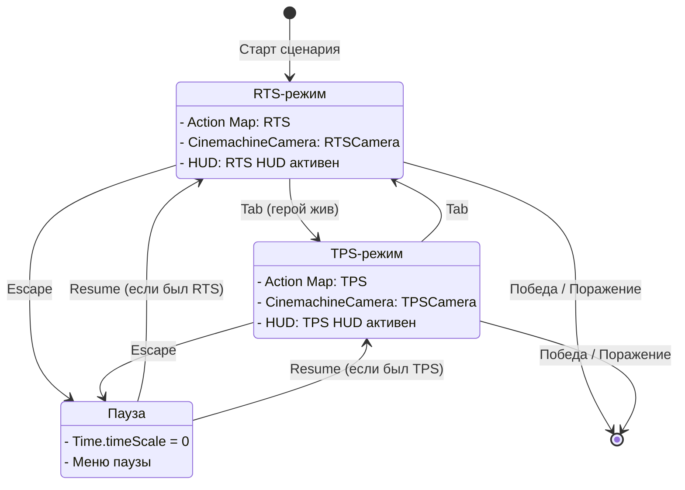
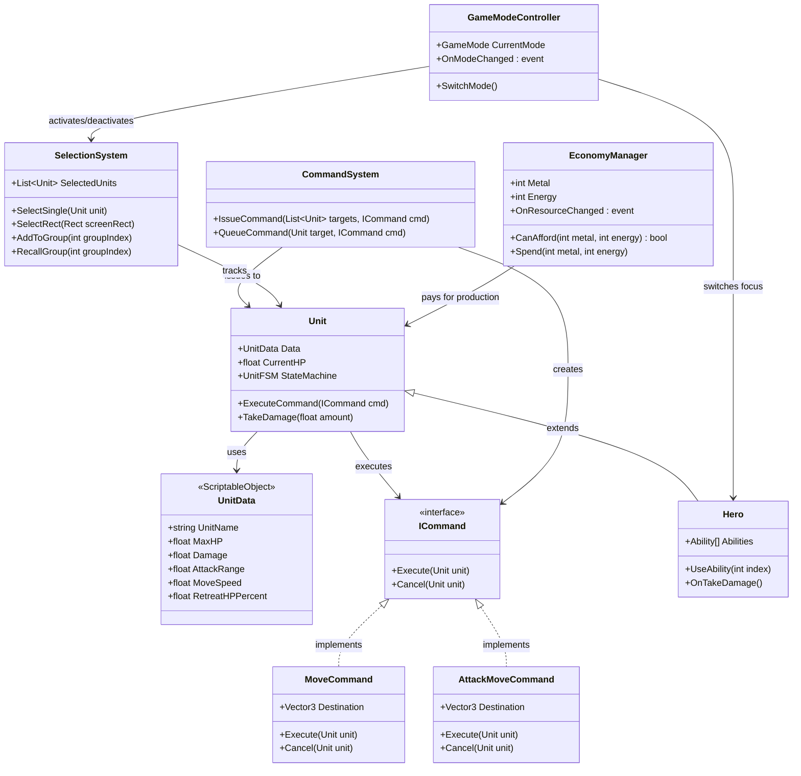

# 02 — Architecture (черновик)

> Версия 0.1 (Фаза 0, 2026-06-10). **Уточняется по мере реализации M1–M5.** Диаграммы отражают проектные намерения, а не финальный код.

---

## 1. Принципы

- **ScriptableObject-данные** — все статы юнитов, зданий, способностей, звуков — в SO-ассетах, не в коде. Изменение баланса — без перекомпиляции.
- **События вместо жёсткой связности** — системы общаются через C# events / UnityEvent; прямые ссылки только между классами одного слоя.
- **Без god-объектов** — нет `GameManager`-монолита. Ответственность разбита по специализированным менеджерам.
- **Логика отдельно от MonoBehaviour** — чистые C#-классы для команд, FSM юнитов, экономической логики; MonoBehaviour — только клей к движку (Transform, NavMeshAgent, ввод). Это делает логику тестируемой без запуска сцены.
- **EditMode/PlayMode тесты** — ключевая логика (команды, FSM-переходы, расчёт урона, очередь производства) покрывается тестами в `Assets/_Project/Tests/`.

---

## 2. Слои архитектуры

```
┌─────────────────────────────────────┐
│           Input Layer               │  Input System: Action Maps RTS / TPS
├─────────────────────────────────────┤
│        GameMode FSM Layer           │  GameModeController: RTS ↔ TPS
├─────────────────────────────────────┤
│         Command Layer               │  CommandSystem: Move/AttackMove/Hold/Patrol/Stop
├─────────────────────────────────────┤
│    Units / Economy Layer            │  Unit FSM, SelectionSystem, EconomyManager, Hero
├─────────────────────────────────────┤
│       Presentation Layer            │  HUD (uGUI), Cameras (Cinemachine 3.1), VFX
└─────────────────────────────────────┘
```

Зависимость строго сверху вниз: Input вызывает GameMode FSM, GameMode FSM вызывает Command Layer, Command Layer управляет Units/Economy. Presentation подписывается на события нижних слоёв — никогда не управляет ими напрямую.

---

## 3. Стейт-машина режимов (stateDiagram-v2)



---

## 4. Диаграмма ключевых классов (classDiagram)



---

## 5. Unit FSM (поведение юнита)

Состояния:

| Состояние | Условие входа | Условие выхода |
|---|---|---|
| Idle | Нет приказов, нет врагов в радиусе | Получен приказ / враг в радиусе |
| Moving | Приказ Move / AttackMove | Достигнута точка / враг в радиусе (AttackMove) |
| Attacking | Враг в радиусе атаки | Враг мёртв / вышел из радиуса / новый приказ |
| Retreating | HP < RetreatHPPercent | HP восстановлено (если есть регенерация) / уход за границу |
| Dead | HP <= 0 | — |

Переходы реализуются чистым C# классом `UnitFSM`, MonoBehaviour лишь вызывает `Update()`.

---

## 6. Структура папок (Assets/_Project)

```
Assets/_Project/
├── Scripts/
│   ├── Core/           — GameModeController, ICommand, UnitFSM
│   ├── Units/          — Unit, Hero, UnitData (SO)
│   ├── Commands/       — MoveCommand, AttackMoveCommand, HoldCommand, PatrolCommand
│   ├── Selection/      — SelectionSystem, SelectionBox (UI)
│   ├── Economy/        — EconomyManager, ProductionQueue
│   ├── Buildings/      — BuildingData (SO), BuildingPlacer
│   ├── AI/             — EnemyAI (M9), NavMesh-обёртки
│   ├── Camera/         — CameraController (RTS), CinemachineHelper
│   ├── UI/             — HUD-компоненты, MiniMap, TooltipSystem
│   └── Input/          — InputRouter (переключает между Action Maps)
├── Editor/ProjectForge/ — единственный Editor-тул
├── Scenes/
├── Prefabs/
├── Data/               — SO-инстансы (UnitData, BuildingData, AbilityData)
├── Art/
├── Audio/
├── UI/
├── VFX/
└── Tests/
    ├── EditMode/
    └── PlayMode/
```
