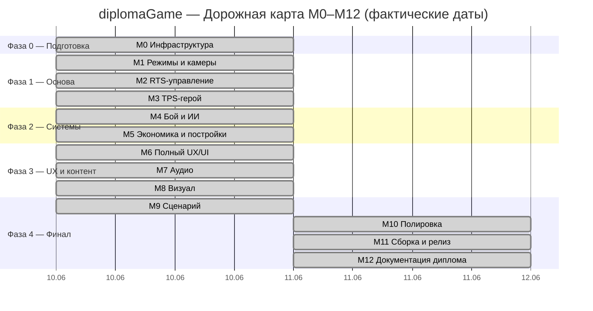

# 03 — Roadmap

> Версия 1.0 (финал M12, 2026-06-11). Все майлстоуны завершены. Фактические даты отражают интенсивную двухдневную сессию сборки: M0–M11 выполнены 2026-06-10–11, M12 — 2026-06-11.

---

## Gantt-диаграмма (фактические даты)

> **Примечание о датах.** Все 13 майлстоунов (включая M12) выполнены за 2 дня: 2026-06-10 (M0–M9) и 2026-06-11 (M10–M12). Это стало возможным благодаря методологии Project Forge (batch-CLI, идемпотентный сетап сцен) и субагентной архитектуре разработки. Сроки не были искусственно сжаты — каждый майлстоун покрыт тестами и финальным коммитом.

---

## Описание майлстоунов и критерии готовности

### M0 — Инфраструктура
**Фактическая дата:** 2026-06-10 · **Статус:** Готов ✅

| Задача | Результат |
|---|---|
| Переименование проекта | diplomaGame, Unity 6000.4.9f1 |
| Git + LFS | `.gitignore`, `.gitattributes`, LFS-паттерны на месте |
| GitHub-репозиторий | https://github.com/arcsymer/diplomaGame (публичный) |
| CI workflows | `tests.yml` + `build-release.yml` (GameCI v4, пинован 6000.4.10f1) |
| Cinemachine 3.1.6 | В manifest.json, компилируется |
| Project Forge | `Tools / Project Forge` открывается в редакторе |
| Docs-Vault | Создано, 7 документов |
| Сцена-песочница | `Sandbox.unity` создана через ForgeBatch |
| Тесты | EditMode 3/3 ✅ |

---

### M1 — Режимы и камеры
**Фактическая дата:** 2026-06-10 · **Статус:** Готов ✅

| Задача | Результат |
|---|---|
| `GameModeController` + `ModeSwitchLogic` | Tab переключает режим, `ModeChanged` срабатывает |
| RTS-камера (Cinemachine 3.1) | WASD-пан, зум скроллом, активна только в RTS |
| TPS-камера (Cinemachine 3.1) | ThirdPersonFollow, кроссфейд ~2с |
| Action Maps RTS / TPS | Все биндинги готовы |
| Forge: Setup Mode Rig (M1) | Идемпотентный batch-сетап сцены |
| Тесты | EditMode 9/9 ✅, PlayMode 8/8 ✅ |

**Пойманные API-грабли Cinemachine 3.x:** `CinemachineRotationComposer` — цель задаётся на `CinemachineCamera`, не на компоненте; `Priority` — структура `PrioritySettings`, сравнение через `.Value`.

---

### M2 — RTS-управление
**Фактическая дата:** 2026-06-10 · **Статус:** Готов ✅

| Задача | Результат |
|---|---|
| `SelectionSystem` | Клик, рамка (с учётом GUI Y-инверсии), Shift-аддитив, контрол-группы 1–5 |
| Визуальный feedback | Кольцо выделения у ног юнита |
| Приказы Move/AttackMove/Hold/Patrol | RMB/A/H/P, выполняются по NavMesh |
| `UnitCommandLogic` | Формационные смещения, патруль A↔B |
| `UnitRegistry` | Статический реестр без аллокаций |
| Forge: Setup RTS Control (M2) + NavMesh | Batch-вызов запекает NavMesh, расставляет 5 юнитов |
| Тесты | EditMode 38/38 ✅, PlayMode 12/12 ✅ |

---

### M3 — TPS-герой
**Фактическая дата:** 2026-06-10 · **Статус:** Готов ✅

| Задача | Результат |
|---|---|
| WASD-движение + вращение мышью | `HeroController` + `HeroMovementLogic` |
| Двойная природа героя | В RTS — NavMeshAgent, в TPS — CharacterController; переключение по `ModeChanged` |
| Стрельба ЛКМ | `HeroShooter`: raycast, `ShotFired` event, `FireRateLogic` с эпсилоном 1e-4 |
| Dash (Q) | `AbilitySystem` + `AbilityCooldownLogic` (кламп остатка к нулю) |
| Forge: Setup Hero (M3) | SO-ассеты способностей, все ссылки через SerializedObject |
| Тесты | EditMode 64/64 ✅, PlayMode 24/24 ✅ |

---

### M4 — Бой и ИИ
**Фактическая дата:** 2026-06-10 · **Статус:** Готов ✅

| Задача | Результат |
|---|---|
| `Health` (IDamageable) | Damaged/Died/AnyDied, смерть однократна |
| SO-статы (`UnitData`) | Marine 100hp/10dmg, EnemyGrunt 80hp/8dmg |
| `UnitCombat` FSM | None/Engaging/Attacking/Retreating |
| Авто-цели | Сканирование раз в 0.25с, ближайший враг — юнит или здание |
| Авто-отступление | HP < 25% → `Retreating`; прямой приказ отменяет |
| `CombatLogic` | Полностью EditMode-покрытый |
| Forge: Config (UnitData-ассеты), Setup Combat (M4) | 3 врага у вражеской базы |
| Тесты | EditMode 78/78 ✅, PlayMode 32/32 ✅ |

---

### M5 — Экономика и постройки
**Фактическая дата:** 2026-06-10 · **Статус:** Готов ✅

| Задача | Результат |
|---|---|
| `ResourceBank` | Один ресурс «Кристаллы», `BalanceChanged` event |
| Пассивный доход | HQ +5💎/2с, Extractor +8💎/2с из `ResourceNode` |
| `BuildingPlacer` | Призрак (зелёный/красный), B/E-клавиши, ESC — отмена |
| `ProductionBuilding` | Очередь до 5, таймер, спавн с авто-rally |
| Rally-point | RMB по зданию; произведённый юнит идёт туда автоматически |
| Forge: Setup M5 | HQ обеих сторон, Barracks, 4 ResourceNode |
| Тесты | EditMode 101/101 ✅, PlayMode 49/49 ✅ |

---

### M6 — Полный UX/UI
**Фактическая дата:** 2026-06-10 · **Статус:** Готов ✅

| Задача | Результат |
|---|---|
| RTS HUD | Ресурсы + UiPulse, панель выделения, миникарта (RenderTexture), подсказки клавиш |
| TPS HUD | uGUI-прицел, HP-бар, 4 слота способностей с кулдаун-заливкой |
| World-space HP-бары | Билборд, скрыты при полном HP |
| Маркеры приказов | Пул анимированных зелёных/красных маркеров, MaterialPropertyBlock |
| Главное меню | Play / Settings / Quit, сцена index=0 |
| Настройки | Качество, fullscreen, 3 громкости, чувствительность мыши; PlayerPrefs |
| Пауза | Escape, timeScale=0 (уступает ESC отмены строительства) |
| Победа / поражение | `GameOverController.ShowVictory/ShowDefeat` |
| Тесты | EditMode 130/130 ✅, PlayMode 60/60 ✅ |

**Пойманные грабли:** `AddComponent<TMP_Text>` → null (абстрактный класс, нужен `TextMeshProUGUI`); TMP Essential Resources без распаковки → NRE в `SetText`; `Toggle.graphic` — публичное поле, сериализуется не как `m_Graphic`.

---

### M7 — Аудио
**Фактическая дата:** 2026-06-10 · **Статус:** Готов ✅

| Задача | Результат |
|---|---|
| CC0/CC-BY контент | Kenney ×4 пака (CC0) + Kevin MacLeod ×3 трека (CC-BY 4.0) |
| `AudioManager` | Синглтон: Music FSM (Menu/Ambient/Combat), кроссфейд 1.5с, SFX-пул ×8, rate-limit голосов 1.5с |
| AudioMixer | Master → Music/SFX/UI/Voice, экспонированные параметры |
| Привязка к событиям | `Health.AnyDied`, `UnitCombat.AnyAttacked`, `ShotFired`, `SelectionChanged`, `OrderIssued`, `BuildingPlaced`, `UnitProduced` |
| Forge: аудио-сетап | Mixer через reflection (fallback-устойчивый) |
| Тесты | EditMode 142/142 ✅, PlayMode 73/73 ✅ |

---

### M8 — Визуал
**Фактическая дата:** 2026-06-10 · **Статус:** Готов ✅

| Задача | Результат |
|---|---|
| CC0-модели Kenney | Blocky Characters (юниты/герой), Space Kit (здания/пропсы/декор), Blaster Kit (оружие) |
| Forge: замена визуала | Child Visual с FBX вместо примитива; URP-материалы; фракционные UnitBlue/UnitRed |
| VFX | 4 типа частиц (выстрел/попадание/взрыв/постройка), `VfxManager` с пулами ×6, подписан на те же события что и Audio |
| Пост-обработка (URP Volume) | Bloom, Vignette, ColorAdjustments, ACES tone-mapping |
| Нормализация FBX | Подгонка масштабов по баундам, не вручную (ADR-012) |
| Тесты | EditMode 152/152 ✅, PlayMode 81/81 ✅ |

---

### M9 — Сценарий
**Фактическая дата:** 2026-06-10 · **Статус:** Готов ✅

| Задача | Результат |
|---|---|
| `EnemyCommander` | Производство юнитов (лимит 12) + волны attack-move 3→5→7 |
| `EnemyWaveLogic` | Чистая статика, полностью EditMode-покрыта |
| `GameWatcher` | Арбитр матча: `Health.Died` обоих HQ → `ShowVictory/ShowDefeat`, `MatchEnded` event |
| Респаун героя | Смерть → корутина 8с → телепорт + полное HP |
| Forge: Setup Scenario (M9) | Вражеский барак, EnemyCommander, GameWatcher с ссылками |
| Тесты | EditMode 169/169 ✅, PlayMode 84/84 ✅ |

---

### M10 — Полировка
**Фактическая дата:** 2026-06-11 · **Статус:** Готов ✅

| Задача | Результат |
|---|---|
| Критический баг: юниты не атаковали здания | `UnitCombat` рефакторен на цели-`Health` из обоих реестров (ADR-010) |
| Баг: толпа на rally-point | Формационные смещения при спавне + анти-застревание (StuckTimeout 1.5с) |
| Перф-полировка | `OverlapSphereNonAlloc`, кэш `Camera.main`, `WaitForSeconds` в VFX-пуле, обновление UI только при изменении, кэшированные ссылки в AudioManager |
| QA: интеграционные тесты | `MatchSimulationTests` (timeScale×10): Victory + Defeat покрыты |
| Тесты | EditMode 169/169 ✅, PlayMode 87/87 ✅ |

---

### M11 — Сборка и релиз
**Фактическая дата:** 2026-06-11 · **Статус:** Готов ✅

| Задача | Результат |
|---|---|
| Windows-сборка | IL2CPP, 64-bit |
| `ScreenshotDirector` | `-autoshot <dir>` — авто-скриншоты RTS/TPS и выход (ADR-011) |
| GitHub Release v1.0.0 | ZIP-архив прикреплён, описание заполнено |
| Атрибуция | Credits в игре (Kevin MacLeod CC-BY) |

---

### M12 — Документация диплома
**Фактическая дата:** 2026-06-11 · **Статус:** Готов ✅

| Задача | Результат |
|---|---|
| `02 - Architecture.md` | Полная актуализация по коду: слои, события, classDiagram, stateDiagram, flowchart, тестируемость |
| `01 - GDD.md` | Финализация: реализованные механики, актуальный баланс, раздел «Сниженный APM» |
| `03 - Roadmap.md` | Gantt с фактическими датами, все вехи done |
| `04 - Decision Log.md` | ADR-010, ADR-011, ADR-012 |
| `00 - Dashboard.md` | M12 done, pie 13/13, ссылка на Improvements/ |
| `Reports/2026-06-11 — Сессия 01 (итог).md` | Итоговое резюме всей сессии |
| `Improvements/00 - Backlog.md` | Заготовка backlog улучшений |
