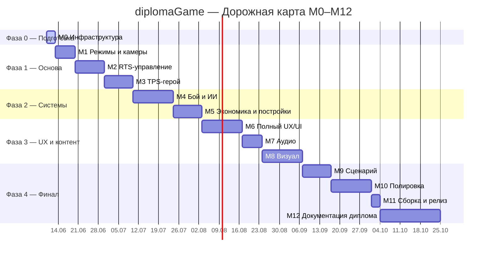

# 03 — Roadmap

> Плановые сроки (старт 2026-06-10, финиш ~ноябрь 2026). Корректируется по факту выполнения майлстоунов.

---

## Gantt-диаграмма

---

## Описание майлстоунов и критерии готовности

### M0 — Инфраструктура
**Срок:** ~3 дня (2026-06-10 – 2026-06-12)

Цель: всё, что нужно для разработки, поднято и работает.

| Задача | Критерий готовности |
|---|---|
| Переименование проекта в diplomaGame | Имя проекта в Unity и папка совпадают |
| Git + LFS с первого коммита | `.gitignore`, `.gitattributes` на месте; `git lfs track` для fbx/blend/wav |
| GitHub-репозиторий | Репо создано, `main` пуш прошёл |
| CI workflows (опционально) | Tests + Build-Release Actions файлы созданы; секреты — задача пользователя |
| Cinemachine 3.1 в manifest | Пакет установлен, компилируется без ошибок |
| Скелет Project Forge | Окно `Tools / Project Forge` открывается в редакторе |
| Документы хранилища | Docs-Vault создан, 7 документов на месте |
| Сцена-песочница | `Scenes/Sandbox.unity` создана, открывается |

---

### M1 — Режимы и камеры
**Срок:** ~7 дней

Цель: переключение RTS ↔ TPS работает, каждый режим имеет свою камеру и Action Map.

| Задача | Критерий готовности |
|---|---|
| `GameModeController` + FSM | Tab переключает режим, событие `OnModeChanged` срабатывает |
| RTS-камера (Cinemachine) | Движение краем экрана + WASD + зум колёсиком |
| TPS-камера (Cinemachine) | Камера следует за heroObject, мышь управляет ориентацией |
| Action Map RTS | Все RTS-инпуты привязаны и работают в RTS-режиме |
| Action Map TPS | Все TPS-инпуты привязаны и работают в TPS-режиме |
| Кросс-режимный инпут | Tab работает в обоих режимах; Escape открывает паузу |

---

### M2 — RTS-управление
**Срок:** ~10 дней

Цель: полноценное управление юнитами в RTS-режиме.

| Задача | Критерий готовности |
|---|---|
| `SelectionSystem` | Клик, рамка, Ctrl+клик, контрол-группы 1–9 работают |
| Визуальный feedback выделения | Подсветка/кружок под юнитом при выделении |
| Приказы Move / Attack-Move / Hold / Patrol / Stop | Правая кнопка мыши; юниты выполняют по NavMesh |
| HUD: панель выделения | Отображает выделенных юнитов и их HP |
| Тест CommandSystem | EditMode-тест: очерёдность команд, отмена |

---

### M3 — TPS-герой
**Срок:** ~10 дней

Цель: герой управляется в TPS с ощущением шутера.

| Задача | Критерий готовности |
|---|---|
| WASD-движение + вращение камерой | Герой двигается относительно камеры |
| Стрельба ЛКМ | Пуля летит из оружия, попадает в коллайдер |
| 2 базовые способности (Q, E) | Способности с кулдауном работают |
| Синхронизация героя RTS↔TPS | Герой в RTS — тот же объект, что в TPS |
| HUD TPS | Прицел, HP-бар, 2 иконки способностей с кулдауном |

---

### M4 — Бой и ИИ
**Срок:** ~14 дней

Цель: боевая система и умное поведение юнитов.

| Задача | Критерий готовности |
|---|---|
| HP / урон / смерть | TakeDamage, смерть = объект деактивируется |
| SO-статы (`UnitData`) | Все числа — в ScriptableObject, не в коде |
| Unit FSM: Idle/Moving/Attacking/Retreating/Dead | Автоматические переходы между состояниями |
| Авто-цели | Юнит сам атакует ближайшего врага в радиусе |
| Отступление при HP < X% | Юнит уходит назад при критическом здоровье |
| PlayMode тест боевой системы | Юнит A атакует и убивает юнита B; урон соответствует UnitData |

---

### M5 — Экономика и постройки
**Срок:** ~10 дней

Цель: авто-экономика и производство работают.

| Задача | Критерий готовности |
|---|---|
| `EconomyManager`: Металл + Энергия | Добавление/вычитание ресурсов, событие изменения |
| Авто-добыча рабочими | Рабочий без приказа сам идёт к ресурсной зоне и добывает |
| Строительство зданий | Строитель → кнопка здания → клик → строится |
| Очередь производства | Клик по зданию → очередь юнитов, таймер, появление |
| HUD экономики | Отображение Металла и Энергии в реальном времени |

---

### M6 — Полный UX/UI
**Срок:** ~14 дней

Цель: игра имеет полный UI: меню, паузу, оба HUD, тултипы, juice.

| Задача | Критерий готовности |
|---|---|
| Главное меню | Play / Settings / Quit |
| Экран настроек | Громкость (Music/SFX), разрешение, качество |
| Меню паузы | Resume / Settings / Main Menu |
| RTS HUD полный | Ресурсы, миникарта, панель выделения, кнопки приказов |
| TPS HUD полный | Прицел, HP, 4 кнопки способностей с кулдауном |
| Тултипы | Наведение на здание/юнит — всплывает карточка |
| PrimeTween juice | Анимации появления кнопок, HUD-пульс при уроне |
| Экран победы / поражения | Кнопки Restart / Main Menu |

---

### M7 — Аудио
**Срок:** ~7 дней

Цель: все звуки и музыка интегрированы.

| Задача | Критерий готовности |
|---|---|
| AudioMixer (Music / SFX / Voice) | Все каналы настроены, привязаны к настройкам |
| Музыка меню и боя | Треки из incompetech/Pixabay (CC-BY, атрибуция добавлена) |
| SFX выстрелов и взрывов | Kenney Sci-fi Sounds или Sonniss GDC |
| SFX UI (клики, ошибки) | Kenney Interface Sounds |
| Голоса юнитов (ack-реплики) | Kenney Voiceover Pack CC0 |

---

### M8 — Визуал
**Срок:** ~14 дней

Цель: арт-контент интегрирован, сцена выглядит как готовый продукт.

| Задача | Критерий готовности |
|---|---|
| Модели юнитов | Quaternius Animated Mech / Tanks / Soldiers CC0 |
| Модели зданий | Quaternius Modular Sci-Fi CC0 |
| UI-кит | Kenney UI Pack Sci-Fi CC0 |
| Шрифты | Russo One (заголовки) + Exo 2 (текст), OFL, кириллица |
| VFX пуль и взрывов | Kenney Particle Pack CC0 + шейдеры URP |
| URP пост-обработка | Bloom, Color Grading, Vignette (Volume) |
| Terrain/карта | ProBuilder или Terrain Tool, освещение запечено |

---

### M9 — Сценарий
**Срок:** ~10 дней

Цель: единственная карта-сценарий с ИИ-противником.

| Задача | Критерий готовности |
|---|---|
| Карта | База игрока + база ИИ + 3–4 ресурсные зоны |
| `EnemyAI` | Противник строит, добывает, атакует волнами |
| Условия победы / поражения | Уничтожение Командного центра противника / своего |
| Скриптованные события (опц.) | Первая атака ИИ через 3 минуты |

---

### M10 — Полировка
**Срок:** ~14 дней

Цель: никаких критических багов, баланс играбельный.

| Задача | Критерий готовности |
|---|---|
| Баг-фикс по результатам плейтестов | Журнал багов закрыт |
| Балансировка UnitData SO | Сценарий можно пройти и проиграть честно |
| Оптимизация | 60 fps в сцене с 50+ юнитами (Windows, средний ПК) |
| QA-прогон | Все PlayMode-тесты зелёные |

---

### M11 — Сборка и релиз
**Срок:** ~3 дня

Цель: публичный релиз на GitHub.

| Задача | Критерий готовности |
|---|---|
| Финальная Windows-сборка | IL2CPP, 64-bit, без Debug.Log в консоли |
| GitHub Release vX.Y.Z | ZIP-архив приложен, описание релиза заполнено |
| Атрибуция в игре | Экран Credits с именами авторов CC-BY ассетов |

---

### M12 — Документация диплома
**Срок:** ~21 день

Цель: все документы диплома готовы к защите.

| Задача | Критерий готовности |
|---|---|
| Пояснительная записка | Главы: введение, постановка задачи, архитектура, ИИ, оценка результата |
| Раздел «Сниженный микроменеджмент» | Академическое обоснование, сравнение с альтернативами |
| Презентация (15–20 слайдов) | Концепция → архитектура → демонстрация → выводы |
| Скриншоты и геймплейное видео | Запись 2–3 мин для демонстрации |
