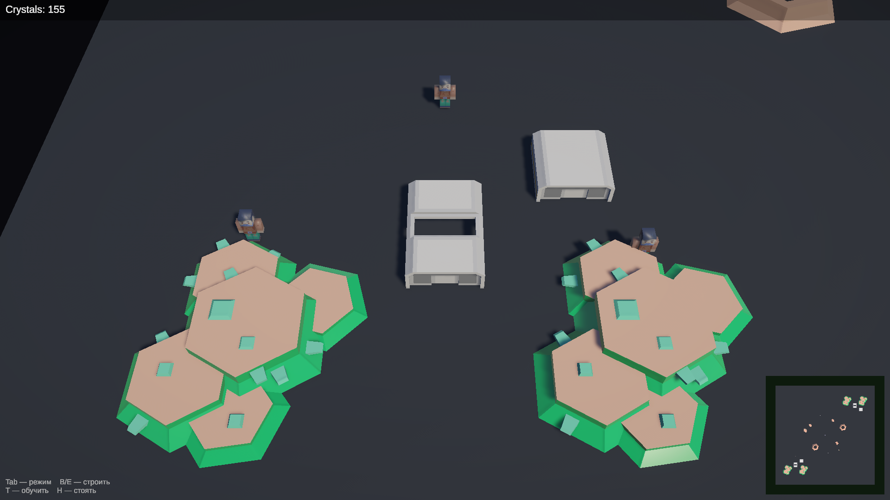
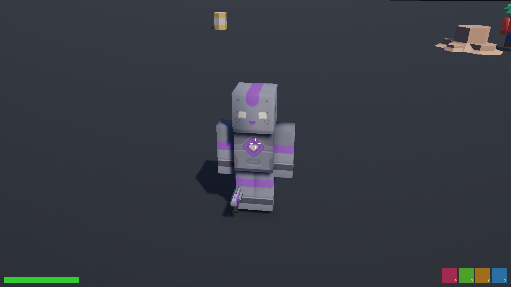

# diplomaGame — RTS + TPS Hybrid (рабочее название)

Дипломный проект: 3D-игра на Unity, в которой игрок **одновременно** командует армией в режиме **RTS** (вид сверху: выделение, приказы, строительство, экономика) и лично управляет героем в режиме **TPS** (вид от третьего лица, стрельба, способности). Переключение режимов — мгновенное, одной кнопкой, без загрузок.

**Академическая идея:** снизить порог входа и требуемый APM классического RTS за счёт умного ИИ юнитов, групповых приказов, авто-добычи и упрощённой экономики — сохранив тактическую глубину. Вдохновлено StarCraft II.

**🎮 Играть в браузере:** https://arcsymer.github.io/diplomaGame/ (WebGL, без установки).

**🎮 Скачать игру:** свежий Windows-билд — в [Releases](../../releases) (`diplomaGame-Windows-x64.zip`: распаковать и запустить `diplomaGame.exe`).

| RTS-режим (командование) | TPS-режим (герой) |
|---|---|
|  |  |

## Геймплей

- **Tab** — мгновенное переключение RTS ↔ TPS.
- **RTS**: ЛКМ — выделение (клик/рамка), ПКМ — приказ (A — attack-move, P — патруль), H — стоять, Ctrl+1..5 / 1..5 — контрол-группы, B/E — строить Барак/Экстрактор, T — обучить юнита (выделив Барак), ПКМ по земле с выделенным Бараком — точка сбора, WASD/колесо — камера.
- **TPS**: WASD + мышь, ЛКМ — стрельба, 1 — рывок (Dash), Esc — пауза.
- **Цель матча**: уничтожить вражеский штаб раньше, чем ИИ-противник (волны которого нарастают со временем) уничтожит ваш. Герой при гибели возрождается на базе через 8 секунд.
- **Сниженный микроменеджмент**: юниты сами выбирают цели, сами отступают при низком HP, добыча кристаллов полностью автоматическая (Экстрактор у месторождения), произведённые юниты сами идут на точку сбора.

## Технологии

| | |
|---|---|
| Движок | Unity 6000.4.9f1 (URP) |
| Ввод | Input System (раздельные Action Maps для RTS/TPS) |
| Камеры | Cinemachine 3.1 |
| Навигация | AI Navigation (NavMesh) |
| UI | uGUI + TextMeshPro |
| Тесты | Unity Test Framework (EditMode/PlayMode) |

Все ассеты — свободные лицензии (CC0/CC-BY/OFL), полный список — в [`Docs-Vault/Licenses & Attribution.md`](Docs-Vault/Licenses%20%26%20Attribution.md). Бюджет проекта — $0.

## Запуск из исходников

1. Установить **Unity 6000.4.9f1** (Unity Hub → Installs).
2. Клонировать с LFS: `git lfs install && git clone <repo-url>`.
3. Открыть папку проекта в Unity Hub.
4. Инструменты автоматизации: меню `Tools → Project Forge`.

## Сборка

Кнопка **Build** в `Tools → Project Forge` (BuildPipeline, Windows x64) либо CI-сборка по тегу `v*` (GitHub Actions → Release).

## Документация

Хранилище [`Docs-Vault/`](Docs-Vault/) (Obsidian): геймдизайн-документ, архитектура, дорожная карта, журнал решений (ADR), отчёты сессий, статистика.
